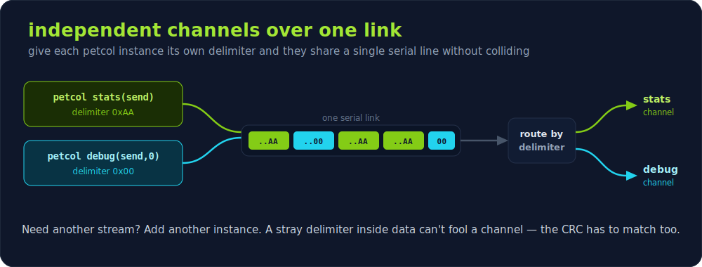

# petcol protocol

`petcol` is the small serial protocol the host tool (`host/petcol.py`) uses
to talk to the firmware (`limesplay_firmware/petprotocol.cpp`).
It frames arbitrary byte payloads, protects them with a CRC-32, and uses a
trailing sentinel byte so the receiver can find packet boundaries in a stream.

The whole point is to stay out of the way: a petcol channel can share a serial
line with ordinary `Serial.print` debugging. Bytes that aren't part of a packet
are handed straight back to you, so you keep using the Arduino Serial Monitor as
usual while structured data is pulled out on the side.


## Model and API (firmware)

A `petcol` instance does **not** own the serial link — you hand it a function
that writes raw bytes out, and it frames/deframes on top of that. There is no
"receive callback": you transmit by calling a method, and you receive by feeding
incoming bytes in one at a time and checking the return value.

```cpp
// A function that writes raw bytes to the link (e.g. Serial).
void sendfunc(const void *data, uint16_t len) {
    Serial.write((const uint8_t *)data, len);
}
// Optional: called for any byte that is NOT part of a petcol packet.
void on_extra(uint8_t b) { /* e.g. forward plain debug text */ }

petcol link(sendfunc, on_extra);   // delimiter defaults to PETCOL_BYTE (0xAA)

// --- send ---
uint8_t msg[] = { 1, 'h', 'i' };   // type 1 = LCD text
link.sendFunc(msg, sizeof(msg));   // frames CRC-32 + length + delimiter and writes it

// --- receive ---
while (Serial.available()) {
    packet_recieved *pkt = link.recv_byte_input(Serial.read());
    if (pkt) {
        // A full, CRC-validated packet arrived: pkt->data, pkt->length.
    }
}
```

- `sendFunc(data, len)` frames one packet and writes it via `sendfunc`.
- `recv_byte_input(byte)` is fed every received byte and returns a
  `packet_recieved*` once a complete, CRC-valid frame is decoded, otherwise
  `NULL`.
- `extra_data_callback` (if supplied) receives bytes that are not part of a
  packet, so a petcol channel can coexist with ordinary serial output.

## Frame layout

A packet is sent as:


```
+-----------------+--------------+--------------+-----------+
| payload (N)     | crc32 (u32)  | length (u16) | 0xAA      |
+-----------------+--------------+--------------+-----------+
  N bytes           4 bytes LE     2 bytes LE     1 byte
```

| Field     | Size | Encoding | Notes                                            |
|-----------|------|----------|--------------------------------------------------|
| `payload` | N    | raw      | Application bytes. `payload[0]` is the message type. |
| `crc32`   | 4    | u32 LE   | CRC-32 of the `payload` bytes (see below).        |
| `length`  | 2    | u16 LE   | `N`, the payload length.                           |
| `0xAA`    | 1    | byte     | Frame terminator. Per-instance (see below); defaults to `PETCOL_BYTE`. |

`N` must satisfy `1 <= N < PACKETSIZE_MAX` (128). The trailer after the payload
is exactly `4 + 2 + 1 = 7` bytes. The firmware serialises the CRC and length
byte by byte (little-endian) rather than copying a struct, so the wire format
never depends on struct padding or alignment.

## CRC-32

Standard CRC-32 (IEEE 802.3 / zlib / PNG):

- reflected input and output,
- polynomial `0xEDB88320`,
- initial value `0xFFFFFFFF`,
- final XOR `0xFFFFFFFF`,
- computed over the `payload` bytes only (not the header).

Check value: CRC-32 of the ASCII string `"123456789"` is `0xCBF43926`.

The firmware implements it bitwise in `petcol::make_CRC`; the host uses
`zlib.crc32`. Both are byte-for-byte identical, and the test
`host/tests/test_petcol.py` compiles a verbatim copy of the firmware
routine (`crc_reference.c`) and asserts the two agree.

## Receiving

Receiving is pull-by-feeding: hand every incoming byte to `recv_byte_input()`,
which appends it to a ring buffer. When a byte equals the delimiter and enough
bytes are buffered, petcol inspects the candidate frame **in place** using
non-destructive reads — it reads the trailing `length`, sanity-checks it
(`length < PACKETSIZE_MAX` and enough bytes present), reads the stored `crc32`,
and recomputes the CRC over the payload. Only if the two match does it consume
the frame: it returns the packet and flushes any bytes that preceded it to the
extra-data callback. If the CRC does not match — for example a stray delimiter
byte inside data — the buffer is left exactly as it was and the byte is treated
as ordinary data, so there is no copy-out-and-restore. Any byte too old to still
be part of a pending frame is released to the extra-data callback in arrival
order, so nothing is ever silently dropped.

## Delimiter (per instance)

The frame terminator is configurable per `petcol` instance via the constructor,
falling back to the `PETCOL_BYTE` (`0xAA`) `#define`:

```cpp
petcol stats(sendfunc);          // delimiter = 0xAA (default)
petcol debug(sendfunc, 0x00);    // separate channel, delimiter = 0x00
```

The Python client mirrors this:

```python
PetcolClient(transport, delimiter=0x00)
encode_packet(payload, delimiter=0x00)
```

Sender and receiver must agree on the delimiter. Distinct delimiters let
multiple petcol instances share one serial link as independent channels (e.g.
one for application packets and one for piped-through debug output via the
extra-data callback).



## Message types

The first payload byte selects the message:

| Type | Name      | Payload after type byte                                  |
|------|-----------|---------------------------------------------------------|
| `1`  | LCD text  | Up to 40 bytes written to the 20x2 display buffer.      |
| `2`  | LED colour| 3 bytes: red, green, blue for the "online" LED animation.|

Receiving any valid packet also resets the firmware's heartbeat timer, which
switches the display from standalone (animation) mode to online (host stats)
mode.
