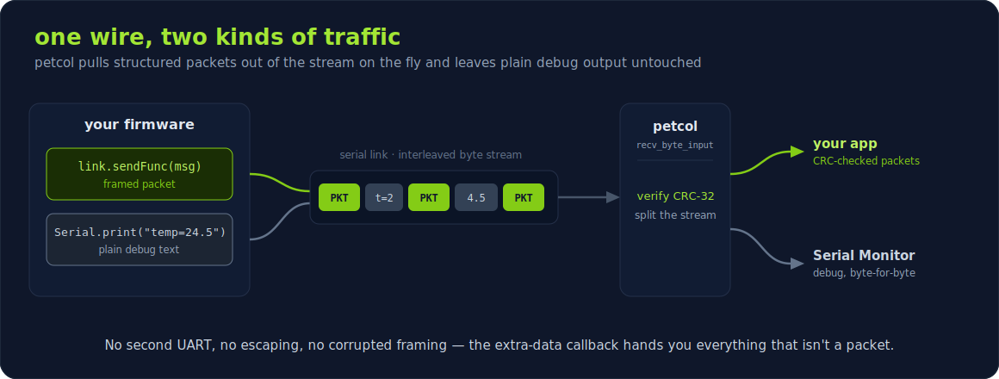
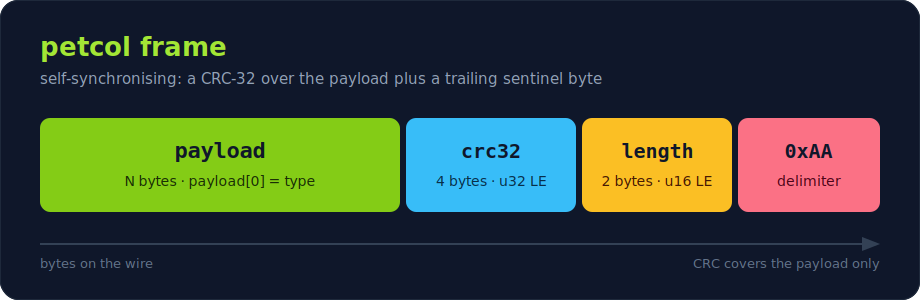
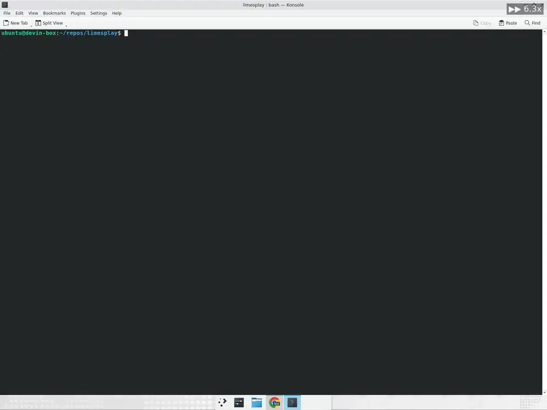

# limesplay
Code and firmware for a 20*2 LCD showing stats for CPU, RAM, ip adress

See firmware for hardware setup, its pretty straight forward

## petcol — the protocol behind it

The host and firmware talk over **petcol**: a tiny self-synchronising framing
layer that wraps arbitrary payloads in a CRC-32 and a trailing delimiter. The
point is that it *gets out of your way* — it carries packets over an arbitrary
byte stream and hands back anything that isn't a packet, so framed data can
coexist with other traffic, and a stray delimiter inside your data can't break
framing because the CRC has to match too. Full spec in [PETCOL.md](PETCOL.md).



## Repository layout

```
petcol/                petcol protocol — canonical implementation (C/C++ + Python)
host/                  Python 3 host tool (sends stats to the LCD over serial)
limesplay_firmware/    Arduino sketch (open this folder in the Arduino IDE/CLI)
examples/              worked examples (e.g. a Qt desktop LCD controller)
PETCOL.md              petcol protocol specification
```

petcol has one canonical source in `petcol/` (`petprotocol.{h,cpp}`, `buf.h`,
`petcol.py`); the firmware and host tool reference it via symlinks and the Qt
example via its `.pro`, so there is a single implementation to keep in sync.

## Host tool (Python 3)

The `host/` tool reads CPU / RAM / clock / IP and pushes them to the LCD over
serial using the *petcol* protocol. It targets Python 3 (tested on Manjaro).

```sh
cd host
python3 -m venv .venv && . .venv/bin/activate
pip install -r requirements.txt

python3 limesplay.py                      # auto-detect port, run forever
python3 limesplay.py --port /dev/ttyUSB0  # explicit port
python3 limesplay.py --interface wlan0    # prefer a NIC for the IP line
python3 limesplay.py --led 255,0,255      # set the online LED colour
python3 limesplay.py --no-serial          # render to stdout, no hardware needed
```

Run `python3 limesplay.py --help` for all options.

### Protocol

`petcol.py` implements the serial framing the firmware expects:



The first payload byte is the message type (`1` = LCD text, `2` = LED RGB) and
the checksum is a standard CRC-32, matching the firmware's `make_CRC`. It both
**encodes** packets (`PetcolClient`) and **decodes** an incoming stream
(`PetcolDecoder`, the host-side mirror of the firmware's `recv_byte_input`). See
[PETCOL.md](PETCOL.md) for the full protocol spec.

### Example: live stream splitter

`petcol_split.py` shows the decoder in action: it reads a stream that mixes
petcol packets with ordinary serial output and splits it live into two panes —
the non-packet bytes (a plain serial console) on the left, the decoded packets
on the right. It runs with no hardware via a built-in demo generator:

```sh
cd host
python3 petcol_split.py --demo                 # built-in mixed stream, no HW
python3 petcol_split.py --port /dev/ttyUSB0     # a real board
```



## Examples

- **`host/petcol_split.py`** — the live stream splitter above (Python, curses).
- **`examples/qt-lcd-controller/`** — a Qt 5 desktop app that drives the LCD
  over serial: type the two display lines (or mirror the focused window title),
  pick the RGB backlight with sliders, and read the board's temperature. It uses
  the canonical petcol for both sending packets and decoding replies. Build it
  with `qmake && make` (needs `qtbase5-dev` and `libqt5serialport5-dev`):

  ```sh
  cd examples/qt-lcd-controller
  qmake && make
  ./petcol_test
  ```

## Firmware (Arduino)

The firmware is a self-contained Arduino sketch in `limesplay_firmware/`. Open
that folder (its `.ino` matches the folder name, as Arduino requires) in the
Arduino IDE or build it with `arduino-cli compile`. Adafruit GFX, LiquidCrystal,
MAX6675 and Vector are pulled from your installed libraries.

### Tests

```sh
cd host
python3 -m unittest discover -s tests
```

The checksum test compiles `tests/crc_reference.c` (a verbatim copy of the
firmware `make_CRC`) and asserts the Python implementation matches it.
